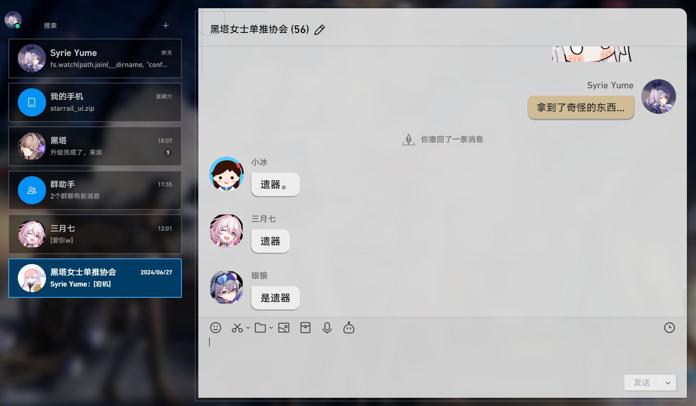
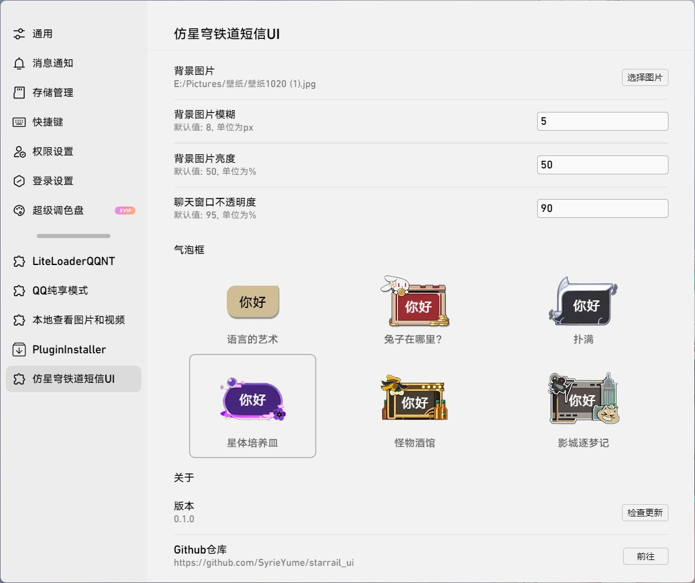
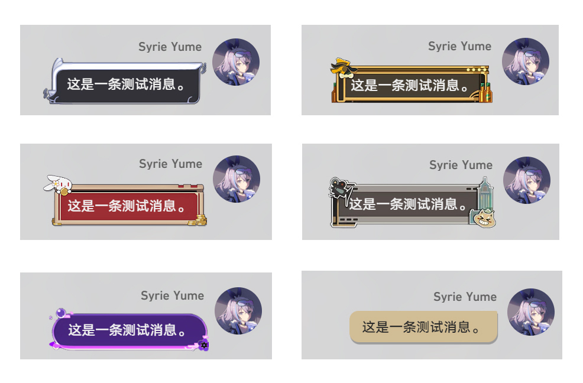

# Star Rail UI
仿照《崩坏：星穹铁道》中角色短信风格的 LiteLoaderQQNT 主题

## 界面展示
### 主界面

### 设置页

### 气泡框

## 安装方法
1. 安装 **[LiteLoaderQQNT](https://liteloaderqqnt.github.io/)**
1. 从 **[Release](https://github.com/SyrieYume/starrail_ui/releases)** 下载最新的插件版本（或直接 clone 本项目）

2. 将下载的插件解压到 LiteLoaderQQNT 目录的 `plugins` 文件夹下

3. 重启 QQ

## 版本适配
- 仅适配 **LiteLoaderQQNT 1.0.0** 及以上版本

- 只在 Windows 11 平台，1080p屏幕下测试过，不清楚高分屏下界面会不会出问题。

## 一些注意事项
1. 聊天界面右上角的工具栏 和 窗口右上角的按钮 会自动隐藏，鼠标移到对应位置就能让它们显现。

2. 如果在使用过程遇到Bug，界面有问题，或者对本插件有什么改进建议，欢迎在 **[Issues](https://github.com/SyrieYume/starrail_ui/issues)** 提出。

3. 与其它主题插件同时使用可能会导致界面出现问题。